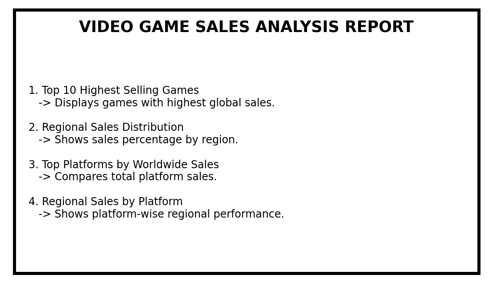
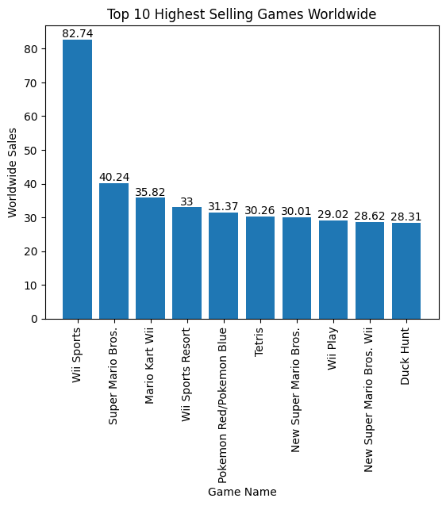
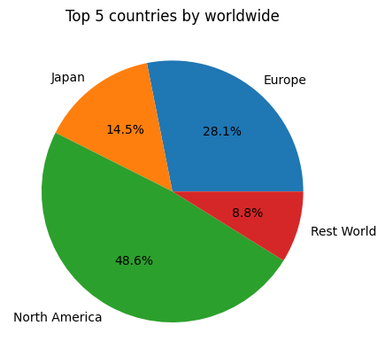
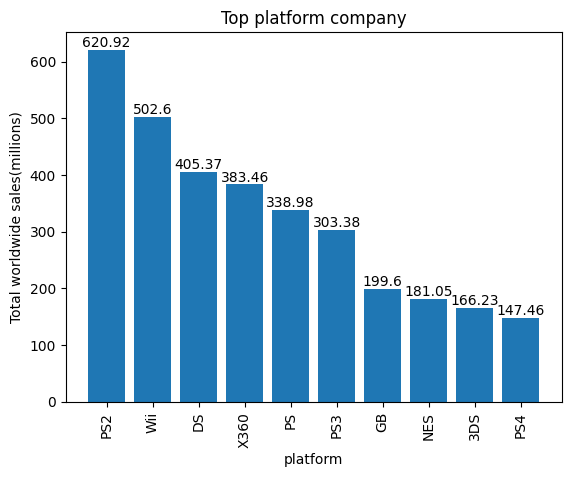
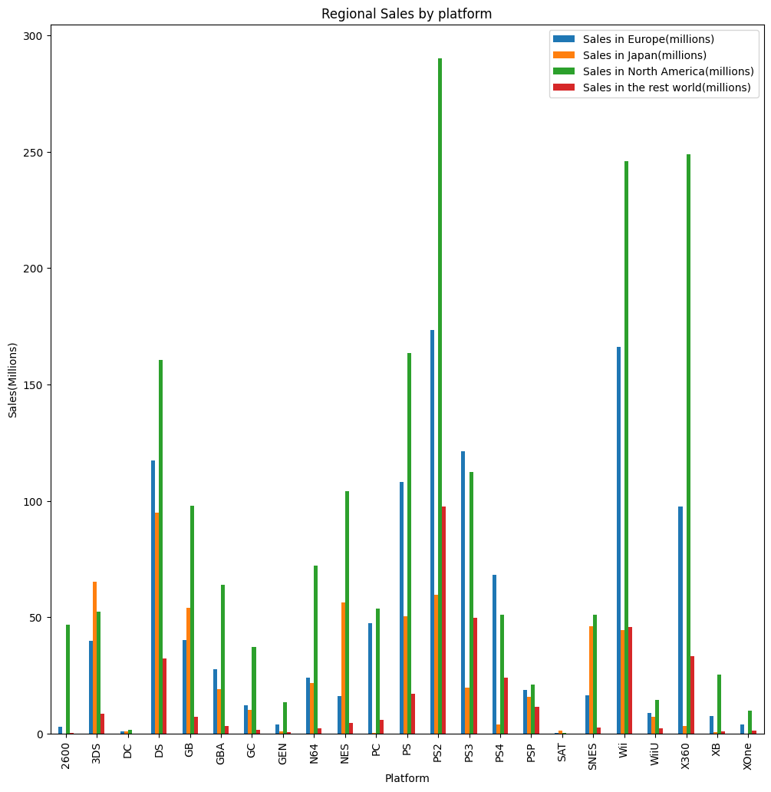

## Video Game Sales Analytics Dashboard

## Project Overview

This project analyzes global video game sales data using Python. The objective is to identify sales trends, top-performing games, platform performance, and regional market preferences through data cleaning, analysis, and visualization.

The project demonstrates fundamental data analytics skills including data preprocessing, exploratory data analysis (EDA), and report generation.

## Objectives

* Clean and preprocess video game sales data.
* Identify the highest-selling games worldwide.
* Analyze regional sales distribution.
* Compare platform performance based on worldwide sales.
* Examine regional sales trends across different gaming platforms.
* Generate a structured analytical report.

## Tools and Technologies

* Python
* Pandas
* NumPy
* Matplotlib
* Seaborn

## Dataset

The dataset contains information about video game sales, including:

* Game Name
* Platform
* Total Worldwide Sales
* Sales in Europe
* Sales in Japan
* Sales in North America
* Sales in Rest of World

## Data Preprocessing

The following preprocessing steps were performed:

* Removed unnecessary columns.
* Removed duplicate game records.
* Standardized platform names.
* Filtered and prepared data for analysis.
* Exported cleaned data into a new CSV file.

## Visualizations

### 1. Top 10 Highest Selling Games Worldwide

Purpose:

* Identify the best-selling games based on total worldwide sales.

Insights:

* Wii Sports emerged as the highest-selling game.
* A small number of titles contribute significantly to global sales.

### 2. Regional Sales Distribution

Purpose:

* Compare sales contributions from different regions.

Insights:

* North America contributes the highest share of video game sales.
* Regional markets show different levels of purchasing behavior.

### 3. Top Platforms by Worldwide Sales

Purpose:

* Compare gaming platforms based on total worldwide sales.

Insights:

* PlayStation 2 generated the highest overall sales.
* Platform popularity has a strong influence on game sales.

### 4. Regional Sales by Platform

Purpose:

* Analyze platform performance across different regions.

Insights:

* North America consistently shows strong sales across most platforms.
* Regional preferences vary among gaming platforms.

## Report Structure

1. Introduction Page
2. Top 10 Highest Selling Games
3. Regional Sales Distribution
4. Top Platforms by Worldwide Sales
5. Regional Sales by Platform
6. Conclusion Page

## Key Findings

* Wii Sports is the highest-selling game in the dataset.
* North America represents the largest regional market.
* PlayStation 2 is the leading platform in worldwide sales.
* Regional preferences differ significantly across platforms.
* Data visualization helps uncover meaningful business insights.

## Project Screenshots

Add screenshots of:

## Learning Outcomes

Through this project, I gained practical experience in:

* Data Cleaning
* Exploratory Data Analysis (EDA)
* Data Visualization
* Business Insight Generation
* Report Creation using Python

---

## Future Improvements

* Interactive dashboards using Plotly
* Power BI dashboard version
* Streamlit web application
* Advanced sales trend analysis
* Predictive analytics for game sales

roject look professional and recruiter-friendly.
